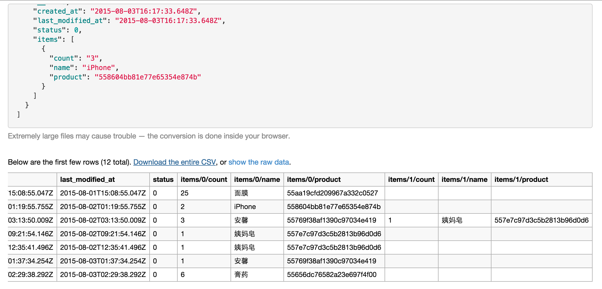

# j2csv = json to csv converter

json to csv converter port to npm

[](http://badge.fury.io/js/j2csv)

## Install 

    [sudo] npm install -g j2csv
  
## Usage

in terminal 

```
  j2csv
```
  
or
 
```
  json2csv
```

